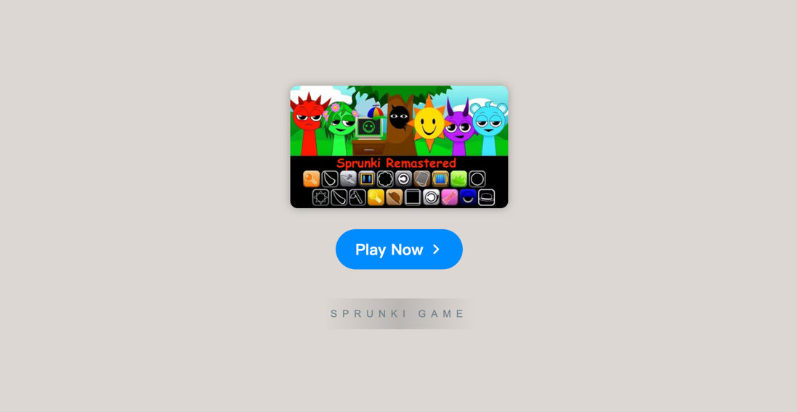

# Sprunki Remastered

    

Welcome to **[Sprunki Remastered](https://sprunkionline.com/remastered)**, an updated and reimagined version of the beloved Sprunki game. This remaster isn’t just a visual upgrade; it’s a complete overhaul that introduces improved graphics, new environments, and enhanced gameplay elements, creating a dynamic and immersive experience. Fans of the original will appreciate the modernized features, while new players are sure to be captivated by the rich, vibrant world that Sprunki Remaster brings to life.

### Table of Contents
- Overview
- Features
- Why It’s Popular
- Getting Started
- Explore More Mods
- Community & Support

### Overview

**Sprunki Remastered** is designed to build upon the original Sprunki game by refining its graphics, animations, and core gameplay. The remaster preserves the essence of Sprunki while adding new layers of depth and excitement, making it a must-try for both longtime fans and newcomers. Dive into the world of **Sprunki but Remaster** or explore additional modes like **Sprunki Phase 3** and **Sprunki but everyone is alive**.

### Features

| Feature               | Description                                                                                   |
|-----------------------|-----------------------------------------------------------------------------------------------|
| **Enhanced Graphics** | Richer environments and improved visuals bring the Sprunki world to life.                     |
| **New Content**       | Experience fresh characters, animations, and themes for a more engaging gameplay.             |
| **Dynamic Gameplay**  | Updated mechanics and smoother animations make each session immersive and satisfying.         |
| **Nostalgic Appeal**  | Keeps the spirit of the original while offering exciting new updates.                         |
| **Mod Support**       | Explore unique mods like **Sprunki but everyone is alive** and **Sprunki Phase 3**.           |
| **Community Sharing** | Connect with other players, share your creations, and gain insights into gameplay strategies. |

### Why Sprunki Remaster is Popular

The **Incredibox Sprunki Remaster Mod** has quickly gained a following for its perfect blend of nostalgia and innovation. Returning players enjoy a refined experience that respects the original game’s charm, while new content and modern enhancements make it exciting and engaging. Newcomers can experience Sprunki in its best form yet, with polished visuals and a deeper gameplay experience that enhances immersion.

Whether you’re looking to explore the exciting updates or simply want to experience Sprunki in a new way, **Sprunki Remaster** is a compelling adventure that welcomes both longtime fans and new players.

### Getting Started

To start playing **Sprunki Remastered**, just follow these simple steps:

1. **Open Browser**: Ensure you're using a compatible browser like Chrome or Firefox.
2. **Visit Sprunki Online**:
    - [Sprunki Remaster](https://sprunkionline.com/remastered)
3. **Start Playing**: Click "Play" and begin your journey in the revamped world of Sprunki.

### Explore More Mods

For a broader experience, check out these fan-favorite modes:

- **Sprunki Phase 3**: Adds unique sound effects and visual themes.
- **Sprunki but everyone is alive**: A mod that brings a fresh narrative twist.
- **Sprunki Infected Mod**: Introduces dark, moody tones for an intense atmosphere.

### Community & Support

Connect with other fans, share your creations, and stay updated on the latest mods and gameplay tips:

- [Sprunki Mods](https://sprunkionline.com/category/sprunki-mods)

Enjoy your journey through the world of **Sprunki Remastered** and discover the endless possibilities it has to offer!
